# Relatório de Sistemas Embarcados - SSC0740
## Trabalho 01 - Extração de Contornos

#### Alunos:
Nome | Número USP
----|:----:
Breno Cunha Queiroz | 11218991
Lucas de Medeiros França Romero | 11219154
Lucas Yuji Matubara | 10734432

<br>

### A Operação
A extração de contornos é uma operação de processamento de imagens que se baseia em identificar pontos em uma imagem onde há mudança brusca de brilho em relação a outro ponto ou área, os quais são chamados de contornos. É a busca por descontinuidades no brilho da imagem.

Nesse trabalho, utilizamos o método de extração que faz a erosão dos pixels de uma imagem A a partir de um kernel B, e depois subtrai a erosão da imagem. 

<p align="center">
 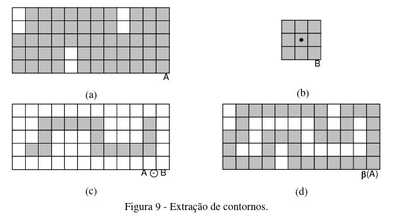
</p>

Em nossas abordagens, entretanto, a operação de subtração da imagem pela erosão é condensada junto com o próprio cálculo da erosão, sendo o valor resultante o valor final da operação para o pixel (d), em vez do valor da erosão para aquele pixel \(c\). 

<br>

### O Código
Foram produzidos com sucesso dois códigos, de acordo com as especificações do trabalho, sendo uma implementação que maximiza o throughput e outra que minimiza o uso de recursos de hardware.

Os códigos recebem como entrada uma imagem em escala de cinza, no formato hexadecimal, de tamanho 320x240, sendo esse tamanho editável no código, e realizam a mesma operação de cálculo sobre os pixels da imagem:
```verilog
erosion =     ((pixels[0]<(`THRESH)) | (pixels[1]<(`THRESH)) | (pixels[2]<(`THRESH)) 
        	| (pixels[3]<(`THRESH))                   		 | (pixels[5]<(`THRESH))
         	| (pixels[6]<(`THRESH))  | (pixels[7]<(`THRESH)) | (pixels[8]<(`THRESH)))
        	& (pixels[4]>(`THRESH));
            
out[y*(`HEIGHT)+x] <= pixels[4]*erosion;
```
Em que o pixel `pixels[4]` é o pixel que está sendo alterado, com base em seu arredor, por meio da atribuição a ``out[y*(`WIDTH)+x]``. Ao final de todas as operações, é escrito um arquivo de saída, cujo nome é especificado no *testbench* da abordagem, que corresponde aos contornos da imagem de entrada, no formato hexadecimal.

É importante ressaltar que utilizamos `defines` para _HEIGHT_, _WIDTH_, _THRESH_ ao invés de `integer` ou `register` no código para diminuir a complexidade do código sintetizado final, o resultado com e sem uso de define será apresentado posteriormente.

O programa [`bmpHex.cpp`](https://github.com/Brenocq/FPGA-BorderDetection/blob/main/src/bmpHex.cpp "Programa de conversão no repositório do projeto") pode ser usado para converder uma imagem *.bmp* em RGB para *.hex* em escala de cinza, para gerar a entrada para a operação. E a saída gerada pode ser transformada de *.hex* para *.png* pelo mesmo programa, para visualização do arquivo de saída.

#### Abordagem que maximiza o throughput
Nessa abordagem, cada pixel é calculado em paralelo, em um único clock, a partir de *for-loops* que se expandem e são executados simultaneamente:

```verilog
// maxThroughput.sv
for(y=1; y<(`HEIGHT-1); y=y+1) begin
  for(x=1; x<(`WIDTH-1); x=x+1) begin
	reg[7:0] pixels [0:8];
	reg[7:0] erosion;
	
	pixels[0] = in[(y-1)*(`WIDTH)+x-1];
	pixels[1] = in[(y-1)*(`WIDTH)+x];
	pixels[2] = in[(y-1)*(`WIDTH)+x+1];
	pixels[3] = in[(y)*(`WIDTH)+x-1];
	pixels[4] = in[(y)*(`WIDTH)+x];
	pixels[5] = in[(y)*(`WIDTH)+x+1];
	pixels[6] = in[(y+1)*(`WIDTH)+x-1];
	pixels[7] = in[(y+1)*(`WIDTH)+x];
	pixels[8] = in[(y+1)*(`WIDTH)+x+1];

	erosion = 
		((pixels[0]<(`THRESH)) | (pixels[1]<(`THRESH))  | (pixels[2]<(`THRESH)) 
		| (pixels[3]<(`THRESH))  | (pixels[5]<(`THRESH))
		| (pixels[6]<(`THRESH))  | (pixels[7]<(`THRESH))  | (pixels[8]<(`THRESH)))
		&& (pixels[4]>(`THRESH));

	out[y*(`WIDTH)+x] <= pixels[4]*erosion;
  end
end
```

##### Esquematização do hardware
Abaixo é apresentada o circuito sintetizado pelo programa Quartus (Intel Quartus) do `maxThroughput.sv` quando WIDTH=3 e HEIGHT=3, ou seja, um único bloco de processamento. Os detalhes serão apresentados na seção final deste relatório.

<p align="center">
 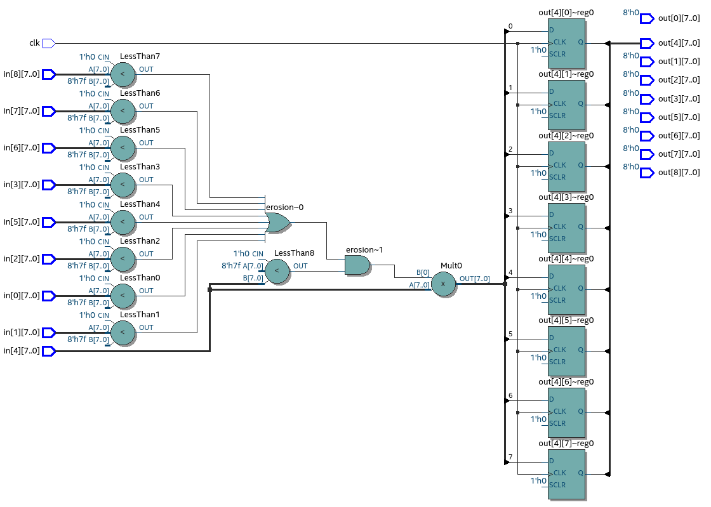
</p>

#### Abordagem que minimiza o uso de hardware
Nessa abordagem, visando diminuir drasticamente o uso do hardware com memória que não está sendo utilizada, as operações são realizadas de acordo com a linha de pixels que está sendo calculada, sendo 3 o número mínimo de linhas na memória para que os cálculos sejam realizados, haja vista que são necessários os valores dos pixels nas linhas imediatamente superior e inferior ao pixel que está sendo visitado para a operação, diminuindo, assim, a memória utilizada de 320x240, para 320x3.

Nesse sentido, o programa inicia lendo duas linhas, e então realiza a operação a cada nova linha que lê, a cada clock, e ao final, escreve no arquivo de saída:

```c 
//minHardwareTest.sv (testbench)
for (y=0; y<2; y=y+1) begin
    for (x=0; x<`WIDTH; x=x+1) begin
        in1[x] <= in2[x];
        in2[x] <= in3[x];
        read = $fscanf(fileIn,"%h",in3[x]);
    end
end

clk=1;
for (y=0; y<`HEIGHT; y=y+1) begin
    @(posedge clk) begin
        for (x=0; x<`WIDTH; x=x+1) begin
            in1[x] <= in2[x];
            in2[x] <= in3[x];
            read = $fscanf(fileIn,"%h",in3[x]);
        end

        for (x=0; x<`WIDTH; x=x+1) begin
            $fwrite(fileOut, "%h ", out[x]);
        end
    end
end
```

Ao final do processamento de cada linha, a linha mais antiga é descartada, e uma nova linha é lida, e funciona no seguinte esquema de memória:
Linha | Status
----|----
1 | Linha mais antiga
2 | Linha sendo processada
3 | Linha mais recente

E após um clock:
Linha | Status
----|----
2 | Linha mais antiga
3 | Linha sendo processada
4 | Linha mais recente

Onde todos os pixels da linha são processados em paralelo:
```c 
//minHardware.sv
always @(posedge clk) begin
	for(x=1; x<(`WIDTH-1); x=x+1) begin
		reg[7:0] pixels [0:8];
		reg[7:0] erosion;

		pixels[0] = in1[x-1];
		pixels[1] = in1[x];
		pixels[2] = in1[x+1];
		pixels[3] = in2[x-1];
		pixels[4] = in2[x];
		pixels[5] = in2[x+1];
		pixels[6] = in3[x-1];
		pixels[7] = in3[x];
		pixels[8] = in3[x+1];

		erosion = 
			((pixels[0]<(`THRESH)) | (pixels[1]<(`THRESH))  | (pixels[2]<(`THRESH)) 
			| (pixels[3]<(`THRESH))  | (pixels[5]<(`THRESH))
			| (pixels[6]<(`THRESH))  | (pixels[7]<(`THRESH))  | (pixels[8]<(`THRESH)))
			&& (pixels[4]>(`THRESH));

		out[x] <= erosion*pixels[4];
	end
end
```

##### Esquematização do hardware
Abaixo é apresentada o circuito sintetizado pelo Quartus do `minHardware.sv` quando WIDTH=3 e HEIGHT=3, ou seja, um único bloco de processamento. Como a unidade de processamento de cada pixel é igual nas duas estratégias não teve mudança no circuito da unidade.

<p align="center">
 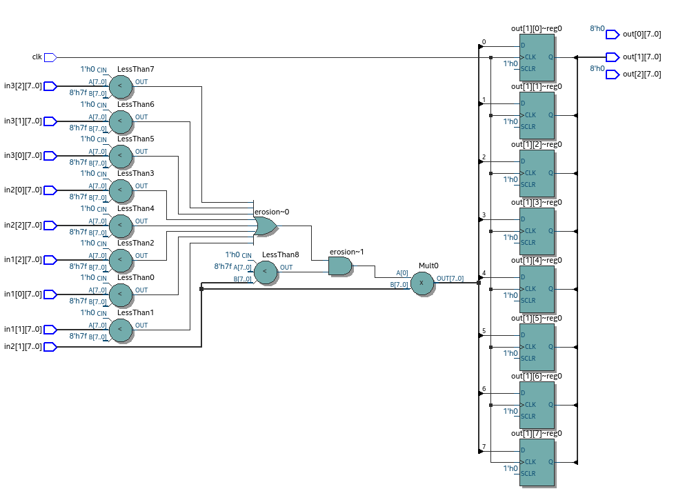
</p>

<br>

### Resultados

Para a validação nós utilizamos 3 imagens, que estão apresentadas abaixo. Os testes foram executados sem a simulação do hardware em si na FPGA, que levaria em conta o tempo de propagação dos sinais. Todos os testes foram executados utilizando o Icarus Verilog.
<p align="center">
 
 
 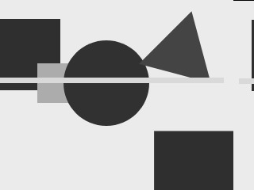
</p>

#### Abordagem que minimiza o uso de hardware
<p align="center">
 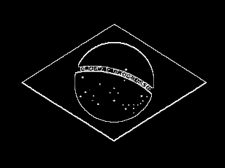
 
 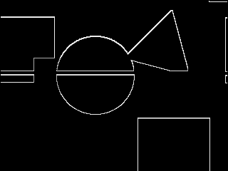
</p>

Obtivemos resultados esperados nas três imagens utilizando a abordagem que minimiza o hardware. Os threshold utilizados foram:

Imagem | Threshold
----|----
brasil | 127
icmc | 200
poly | 127

Também processamos o poly utilizando o threshold de 230 para ver a diferença (imagem abaixo). É possível notar que mais formas foram detectadas e ocorreu um aumento no ruido devido aos próprios pixels da imagem que não eram homogêneos.

<p align="center">
 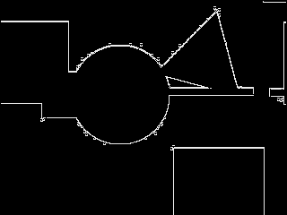
</p>


#### Abordagem que maximiza o throughput
<p align="center">
 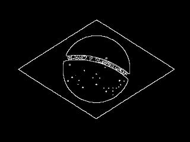
 
 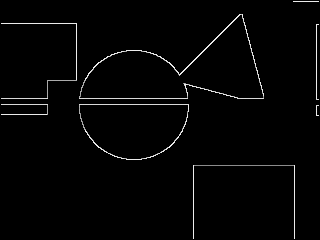
</p>

As duas abordagem tiveram resultados identicos ao utilizar o mesmo threshold, o que era esperado. Nesta abordagem também testamos processar a imagem do icmc com o threshold de 127, o que resultou em ruido devido à cor nos pixels da imagem.

<p align="center">
 
</p>

<br>

### Simulação de Hardware
Sintetizamos o circuito utilizando o programa Quartus, abaixo serão apresentados algumas conclusões e resultados interessantes que foram obtidos. Foram realizados somente testes de uso de hardware, não foi abordado análise temporal em nossas simulações.

#### Unidade de processamento
Como já apresentado a unidade de processamento não se alterou ao utilizar as duas abordagem. Um resultado interessante que tivemos durante os primeiros testes foi que ao utilizar integer ao invés de define para definir o `width` no código obtivemos resultados bastante diferentes ao sintetizar devido à necessidade de realizar calculos em cima dos registradores.

``` verilog
// Utilizando integer
integer width = 3;
pixels[0] = in[(y-1)*width+x-1];
pixels[1] = in[(y-1)*width+x];
pixels[2] = in[(y-1)*width+x+1];
pixels[3] = in[(y)*width+x-1];
pixels[4] = in[(y)*width+x];
pixels[5] = in[(y)*width+x+1];
pixels[6] = in[(y+1)*width+x-1];
pixels[7] = in[(y+1)*width+x];
pixels[8] = in[(y+1)*width+x+1];

// Utilizando constante
`define WIDTH 3
pixels[0] = in[(y-1)*(`WIDTH)+x-1];
pixels[1] = in[(y-1)*(`WIDTH)+x];
pixels[2] = in[(y-1)*(`WIDTH)+x+1];
pixels[3] = in[(y)*(`WIDTH)+x-1];
pixels[4] = in[(y)*(`WIDTH)+x];
pixels[5] = in[(y)*(`WIDTH)+x+1];
pixels[6] = in[(y+1)*(`WIDTH)+x-1];
pixels[7] = in[(y+1)*(`WIDTH)+x];
pixels[8] = in[(y+1)*(`WIDTH)+x+1];
```

Abaixo temos à esquerda a unidade de processamento utilizando integer, e à direita utilizando define.
<p align="center">
 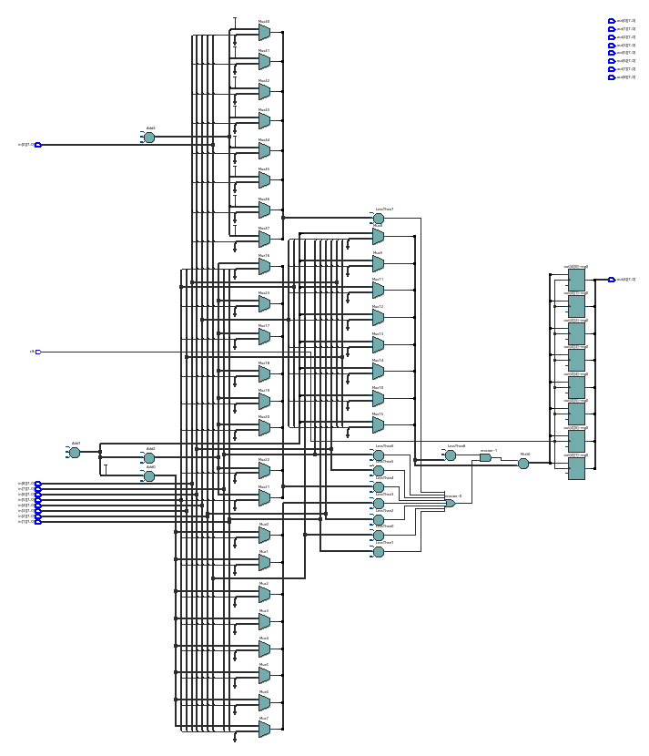
 
</p>

Apesar dessa diferença no esquemático não houve alteração na quantidade de ALMs (Adaptive Logic Module) utilizados. Cada ALM implementa uma LUT de 6 inputs de acordo com a [documentação da FPGA Cyclone V](https://www.intel.com/content/dam/www/programmable/us/en/pdfs/literature/hb/cyclone-v/cv_5v2.pdf).

<p align="center">
 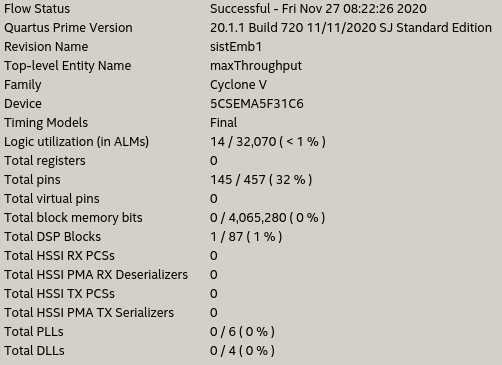
 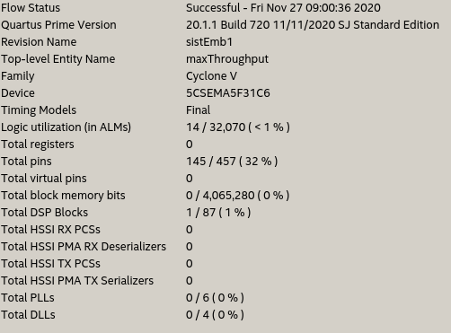
</p>

#### Abordagem que maximiza o throughput
Para realizar o comparativo de uso do hardware simulamos o hardware que seria gerado para uma imagem 9x9. No caso da abordagem que maximiza o thoughput seria gerados 64 unidades de processamento pois as bordas não são processadas. Além disso são gerados conexões para zerar as bordas nas sáidas (neste caso 32 conexões). Abaixo é apresentado o circuito sintetizado. Para melhor visualização também geramos um [pdf](./images/maxThroughput9x9.pdf) através do Quartus.

<p align="center">
 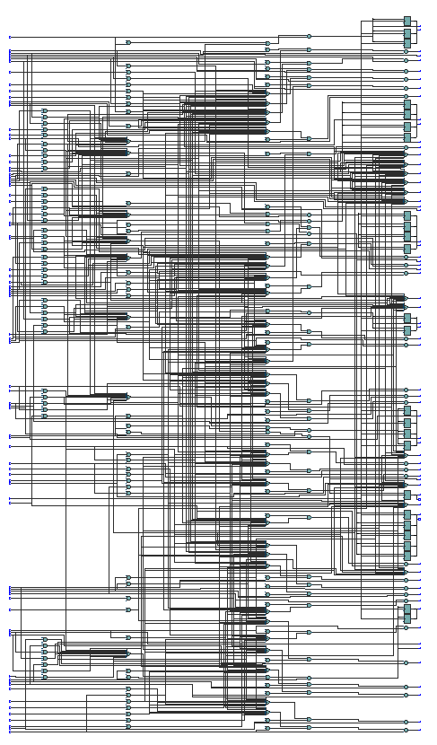
</p>

Através das estatísticas geradas ao definir as conexões em hardware para a FPGA Cyclone V é possível notar que apesar de ter espaço o suficiente de ALMs para o circuito, não é possível mapear todos os pinos de input/output por falta de pinos. Vale ressaltar que a quantidade de pinos que aparece nas estatísticas é a quantidade total de pinos na placa Cyclone V, mas nem todos podem ser utilizados como input/output.

<p align="center">
 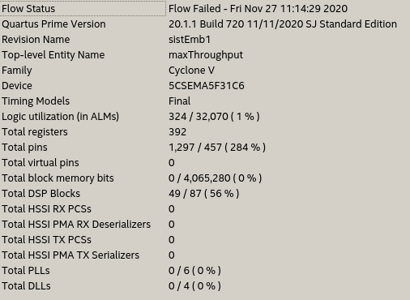
</p>

#### Abordagem que minimiza o hardware
Nesta abordagem apesar da imagem ser 9x9 somente será necessário criar 7 unidades de processamento (quantidade de colunas-2). Além disso é necessário uma conexão em zero do primeiro e ultimo pixels da linha. Nesta abordagem tem um input de 9x3 pixels e saída de somente 9, o que também ajuda a minimizar o uso dos pinos de input/output da FPGA. Assim como na abordagem anterior geramos um [pdf](./images/minHardware9x9.pdf) para melhor visualização.\
Obs: É possível contar a quantidade de unidades de processamento pela quantidade de portas OR para o calculo do erosion;

<p align="center">
 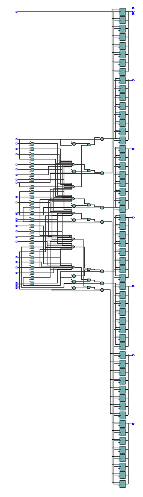
</p>

Agora com o uso minimizado do hardware foi possível utilizar bem menos ALMs, registradores, e pinos. Entretando, mesmo assim não é possível carregar este código na Cyclone V por falta de pinos de input/output. Para superar este problema poderia ser desenvolvido uma interface para carregar os dados nos registradores utilizando os somente pinos disponíveis de input/output e após o carregamento ser executado em paralelo.

<p align="center">
 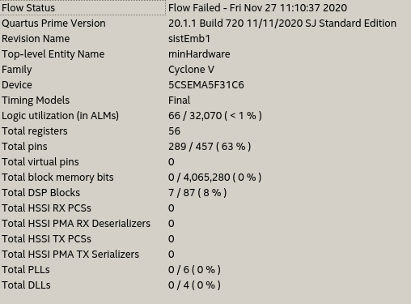
</p>

### Conclusão
Foi possível desenvolver um programa que consegue executar o algorítmo de detecção de bordas em imagens em grayscale que funciona como o esperado de acordo com o livro refência utilizado. Entretanto, as duas técnicas utilizadas resultariam em problemas ao programar a placa FPGA Cyclone V devido à falta de pinos de input/output. Para resolver este problema propomos a criação de uma interface de comunicação para popular os registradores internos. Neste trabalho foi realizado um simulação lógida do código e analisado a utilização do hardware de uma FPGA Cyclone V, não sendo abordado simulações que levam o tempo de propagação dos sinais em consideração.


### Referências
- [Processamento Digital de Imagens](http://paginapessoal.utfpr.edu.br/hvieir/downloads/pdi99.pdf/view) - Ogê Marques Filho, Hugo Vieira Neto.A
- [Documentação Cyclone V](https://www.intel.com/content/dam/www/programmable/us/en/pdfs/literature/hb/cyclone-v/cv_5v2.pdf) - Intel
- [Intel Quartus](https://www.intel.com.br/content/www/br/pt/software/programmable/quartus-prime/overview.html) - Intel
